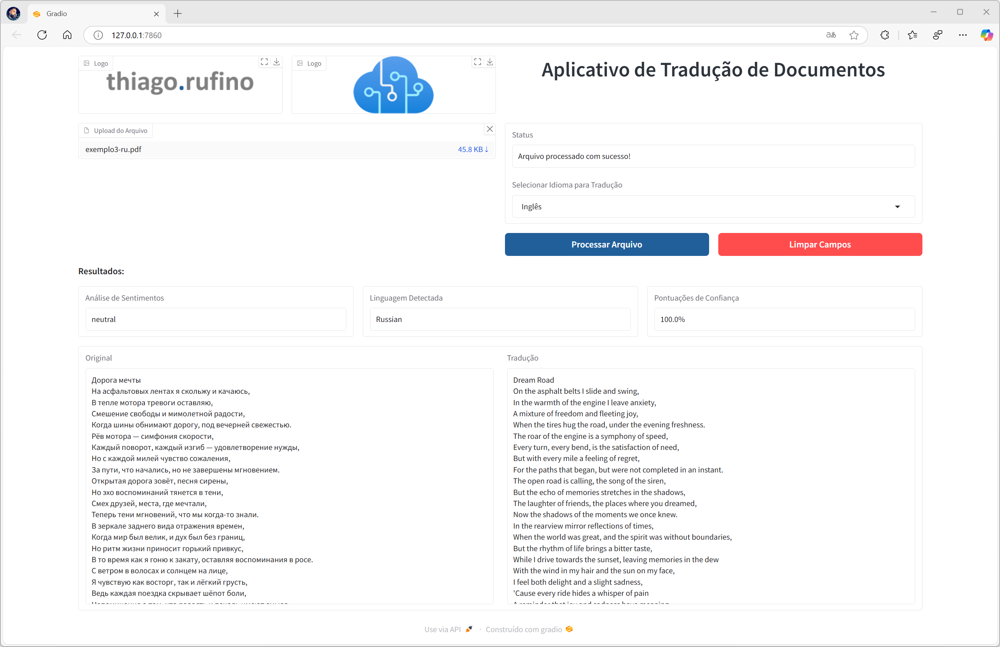

# Aplicativo para Tradução de Documentos

Python que permite ao usuário ler arquivos de texto e PDF, detectar automaticamente o idioma do conteúdo, demonstrando as pontuações de confiança a nível de documento, e traduzir o conteúdo para um dos 8 idiomas disponíveis na aplicação. Além disso, também fornecemos rótulos de sentimentos, classificando o conteúdo como negativo, neutro ou positivo.



## Funcionalidades

- **Detecção de Idioma**: Detecta automaticamente o idioma do conteúdo e exibe a confiança da detecção.
- **Tradução de Conteúdo**: Traduz o texto detectado para um dos 8 idiomas suportados.
- **Análise de Sentimentos**: Classifica o conteúdo como positivo, neutro ou negativo.
- **Interface Interativa**: Utiliza a biblioteca Gradio para uma interface amigável e intuitiva.

## Tecnologias Utilizadas

- **Python**: Linguagem principal de desenvolvimento.
- **Azure AI Services**: Serviços de análise de texto e tradução.
- **Gradio**: Biblioteca para criar uma interface interativa.
- **pdfplumber**: Para leitura de conteúdo de arquivos PDF.
- **dotenv**: Para gerenciar variáveis de ambiente de maneira segura.

## Configuração

1. **Instale as dependências**:
    ```bash
    pip install -r requirements.txt
    ```

2. **Configuração das Variáveis de Ambiente**:
   Crie um arquivo `.env` na raiz do projeto e adicione as seguintes variáveis com as informações dos serviços Azure:

    ```plaintext
    AI_SERVICE_ENDPOINT=your_text_analytics_endpoint
    AI_SERVICE_KEY=your_text_analytics_key
    TRANSLATOR_ENDPOINT=your_translator_endpoint
    TRANSLATOR_KEY=your_translator_key
    TRANSLATOR_REGION=your_translator_region
    ```

3. **Execute o aplicativo**:
    ```bash
    python nome_do_script.py
    ```

## Como Usar

1. **Upload do Arquivo**: Faça upload de um arquivo de texto (.txt) ou PDF (.pdf).
2. **Selecionar Idioma de Tradução**: Escolha o idioma desejado para tradução.
3. **Processar Arquivo**: Clique no botão "Processar Arquivo" para iniciar a detecção de idioma, análise de sentimentos e tradução.
4. **Limpar Campos**: Clique em "Limpar Campos" para remover o conteúdo e reiniciar o processo.

## Idiomas Suportados para Tradução

- Árabe
- Espanhol
- Inglês
- Japonês
- Mandarim
- Português (Brasil)
- Russo
- Turco

## Estrutura do Projeto

```plaintext
.
├── Img/                     # Imagens usadas na interface do Gradio
├── main.py                  # Script principal do aplicativo
├── requirements.txt         # Dependências do projeto
└── README.md                # Documentação do projeto