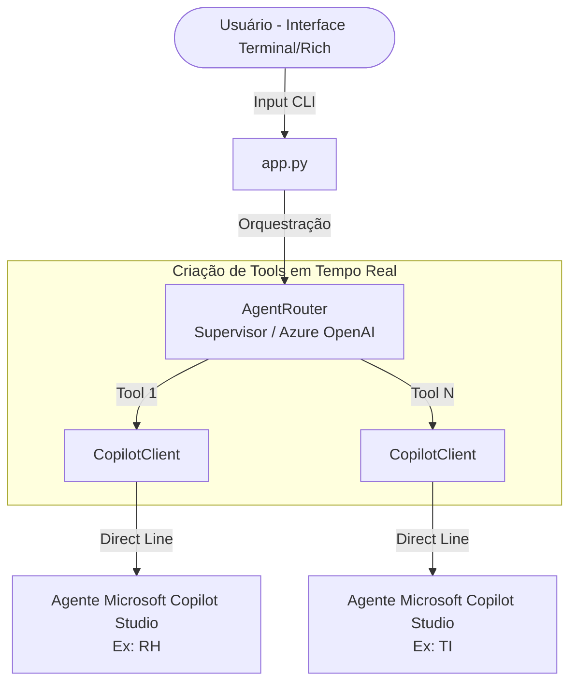

# Microsoft Agent Framework + Copilot Studio

Um orquestrador *serverless* construído em Python que utiliza o **Microsoft Agent Framework** atuando como supervisor. Ele toma a frente para rotear inteligentemente diálogos e intenções para agentes especialistas do **Microsoft Copilot Studio** (Power Platform) via Direct Line. Tudo isso enquanto mantém o contexto da sessão contínuo no seu terminal.

---

## 🎯 Visão Geral e Funcionalidades

- **Roteamento Inteligente:** O Supervisor (LLM) avalia as necessidades da sua requisição e deduz ativamente qual Copilot Especialista será chamado – permitindo transições impecáveis e até encadeamento de múltiplos copilots (ex: TI + RH).
- **Escalabilidade Dinâmica:** Adicione "N" agentes dinamicamente apenas listando-os nas variáveis de ambiente (`COPILOT_AGENTS=...`) sem reler as amarras do código legado.
- **Resiliência e Performance:** Cliente Direct Line refatorado com *connection pooling* assíncono robusto e retentativas automáticas (`tenacity`).
- **Segurança Contextual:** Preserva a originalidade da resposta do Copilot limitando ao máximo as chances de alucinações da LLM organizadora.

---

## 🏗️ Arquitetura

A estrutura foi modelada para ser adaptável, estendendo-se em múltiplos agentes sem fricção:



### Estrutura de Diretórios e Responsabilidade Curada

| Arquivo/Pasta | Responsabilidade Curada |
|---|---|
| `app.py` | Loop de chat interativo formatado graficamente com a biblioteca Rich. |
| `core/router.py` | Cérebro Mestre (Supervisor). Decide qual(is) agente(s) acionar baseando-se no contexto. |
| `core/tools/copilot_tools.py` | Fábrica de Tools dinâmicas auto-registradas no runtime do framework. |
| `core/copilot_client.py` | Comunicação API (*Direct Line*). Lida eficientemente com conversationId, persistência e watermarks. |
| `core/session_store.py` | Implementação do *Store* de Memória e base para plugar Redis/Bancos no futuro. |
| `core/config.py` | Conversor e validador do ambiente estático e dinâmico (`.env`). |

---

## ⚙️ Pré-requisitos

1. **Python 3.11+**
2. **Azure OpenAI:** Recurso habilitado e um Deployment liberado (GPT-4o ou modelo similar superior).
3. **Microsoft Copilot Studio:** No mínimo um Agente de conversa publicado com o canal **Direct Line** ativado.

---

## 🚀 Instalação e Configuração Passos a Passo

### 1. Preparação Local (Virtual Environment)
Inicie ativando o terminal em seu diretório e rodando os comandos de dependência:
```bash
# 1. Crie e ative a Virtual Environment (venv)
python -m venv .venv

# -> No Windows
.venv\Scripts\activate
# -> No Linux / macOS
source .venv/bin/activate

# 2. Instalação do projeto + dependências base
pip install -e .

# [Opcional] Instalação ampla com bibliotecas de desenvolvimento e testes (pytest, mock, respx)
pip install -e ".[dev]"
```

### 2. Azure OpenAI (Modelos LLM)
Para o motor semântico do orquestrador funcionar, configure o recurso no seu provedor:
- Crie o recurso via portal do Azure e instancie um modelo em **Deployments** (Recomenda-se o `gpt-4o`). Guarde essas chaves para uso posterior da variável de ambiente:
    - **Endpoint**
    - **API Key** (Ou se preferir, via identidade de AzureCredential / App Registration)
    - **Deployment Name**

### 3. Publicando Agentes Copilot Studio 
Dentro da plataforma para cada agente (RH, TI, Jurídico):
- Projete as intenções, tópicos e publique o Agent.
- Vá nas propriedades/Settings e libere a conectividade nativa para o canal **Direct Line**.
- Anote e reserve cuidadosamente o seu **Secret Key** - Sem ele, será impossível contatar a API.

---

## 🔒 Variáveis de Ambiente (.env)

Faça uma cópia do exemplo base incluído no repositório:
```bash
cp .env.example .env
```
Customize com suas propriedades:

| Variável | Obrigatoriedade | Descrição Rápida |
|---|:---:|---|
| `AZURE_OPENAI_API_KEY` | **Sim** | Chave API principal para o bot roteador. |
| `AZURE_OPENAI_ENDPOINT` | **Sim** | URL de acesso (`https://<...>`). |
| `AZURE_OPENAI_DEPLOYMENT_NAME` | **Sim** | Nome literal listado no studio do Azure (ex: `gpt-4o`). |
| `COPILOT_AGENTS` | Recomendado | *Modo Dinâmico Multi-Agente:* Formato Lista (`RH,TI,JURIDICO`). Se passado, o roteador gera ferramentas exclusivas com base neste ID ignorando varíaveis do modo legado. |
| `COPILOT_<ID>_DIRECT_LINE_SECRET` | **Sim** | Chave secreta nativa Direct Line gerada em portal para o ID referente. *(Modo legado base usa `DIRECT_LINE_SECRET_RH` e `_TI`)* |
| `COPILOT_<ID>_NAME` | Não | O Título estético customizado da interface `app.py`. |
| `POWER_PLATFORM_ENV_<ID>` | Não | Marcador apenas analítico e informativo do Tenant Id. |
| `DIRECT_LINE_TIMEOUT_SEC` | Não | Segundos aguardando resposta (Padrão: `45`). |
| `DEBUG_MODE` | Não | Expõe timeline de steps em console (Padrão: `false`). |
| `STRUCTURED_LOGGING` | Não | Formatação pronta em Log em JSON (Padrão: `false`). |

---

## 👾 Executando o Orquestrador

Com seu terminal ativo juntamente com as variáveis bem inseridas, despache a rotina da aplicação em tela com a chamada final:
```bash
# Windows
.venv\Scripts\python app.py

# Linux / macOS
.venv/bin/python app.py
```

### Utilitários Disponíveis via CLI Interativo (/commands)

Dentro da interação com o assistente, utilize os slashes especiais para controle do framework:
* `/agents` — Mostra o registro real-time validado e seus metadados.
* `/timeline` — Apresenta um rastreamento e eventos de latência nas transações.
* `/status` — Payload bruto contendo as posições textuais do JSON da atual sessão.
* `/activities` — Transações brutas repassadas da rede HTTP sobre a Direct Line.
* `/reset` — Anula os vetores da memória e reinicia uma conversa pura e fresca.
* `/session <id>` — Intercalar e criar novas janelas de sessões concorrentes simuladas.
* `/help` e `/exit` — Auxiliares gerais.

---

## 🛑 Limitações e Observações Técnicas Atuais

- **Memória Efêmera:** Por padrão a gestão usa alocação em memória volátil de Python (`InMemorySessionStore`). Sendo um sistema que escala dinâmico o tráfego, as abstrações contam com o método base abstrato em *Protocol* que prevê substituição simples para plugar provedores de persistência robustos em nuvem visando o escalonamento multi-usuario.
- **Segurança de Borda:** Trabalha em arquiteturas B2B com integração simples Server-to-Server omitindo abstrações sofisticadas para repassar tokens de *SSO/Usuário Final Autenticado* aos Agents filhos. 
- **Modo CLI:** Não expõe portas/endpoints Webhook HTTP out-of-the-box para interop, feito para a depuração via interface de comando iterativa (CLI).
