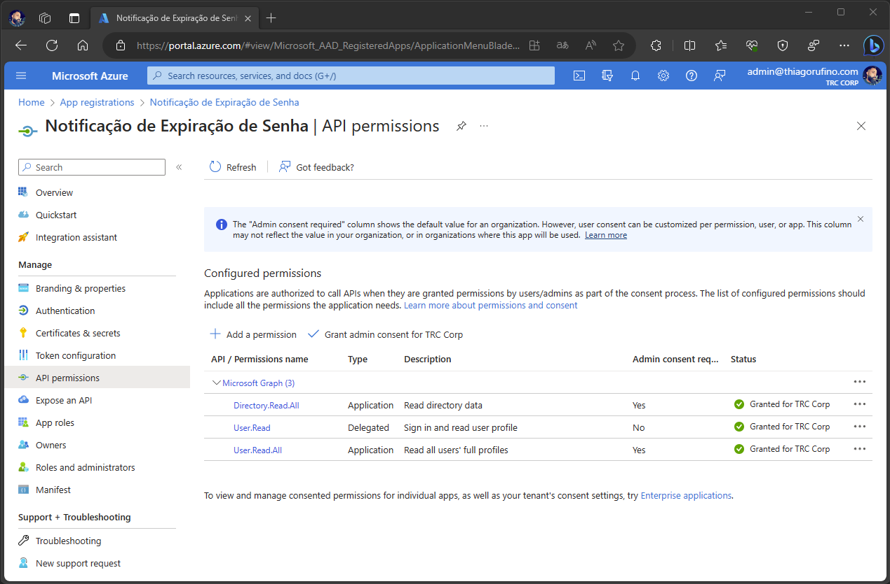
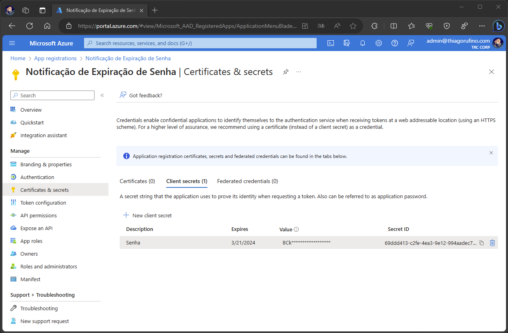
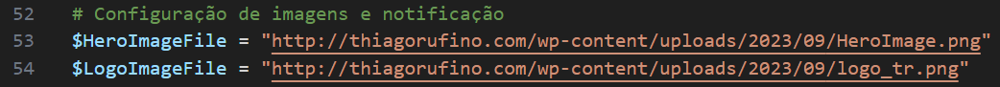
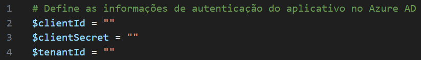
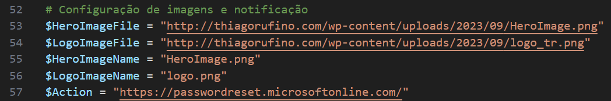
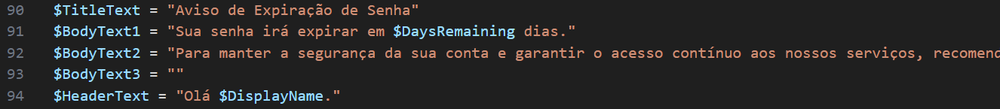
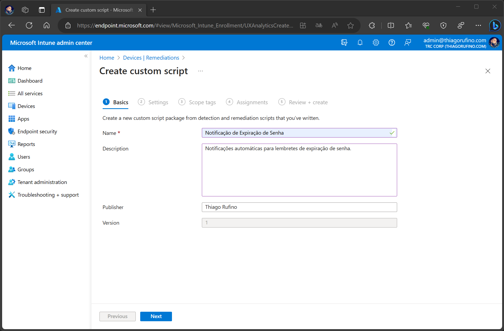
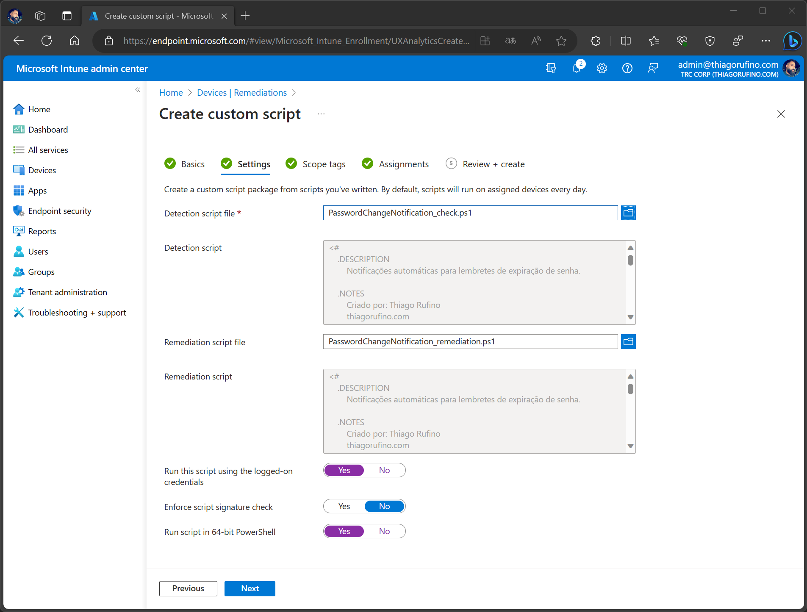
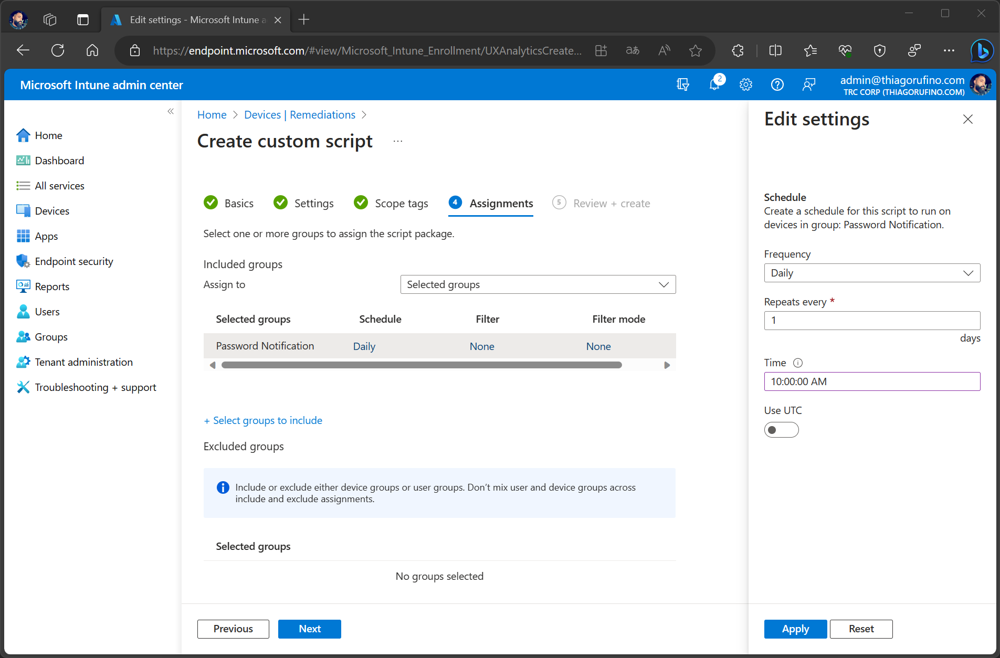

        

  

# Notificações automáticas para lembretes de expiração de senha.

Uma parte crítica da segurança está relacionada à gestão de senhas. Senhas fortes e atualizadas regularmente são um dos principais pilares da proteção dos dados.

No entanto, administrar efetivamente a política de alteração de senhas pode ser um desafio. Como garantir que os usuários estejam cientes da necessidade de alterar suas senhas antes que expirem ? A resposta pode estar na automação e nas notificações.
  

# Benefícios de Notificações de Senha Prestes a Expirar
A implementação de notificações Toast para senhas prestes a expirar traz vários benefícios:

* **Consciência do Usuário:** Os usuários estarão cientes da necessidade de alterar suas senhas com antecedência, reduzindo o risco de bloqueios de contas devido a senhas expiradas.

* **Melhor Gestão de Segurança:** Isso ajuda a reforçar a política de segurança de senhas e incentiva a conformidade dos usuários.

* **Redução de Sobrecarga de Suporte:** Com notificações automatizadas, os usuários podem tomar a iniciativa de alterar suas senhas de maneira simplificada, resultando em uma redução significativa no número de solicitações à equipe de suporte. Isso promove a autonomia dos usuários e otimiza a eficiência da equipe de suporte.

Em resumo, as notificações para senhas prestes a expirar são uma abordagem inteligente para melhorar a segurança de senhas em sua organização. Com a automação adequada e a comunicação eficaz, você pode manter seus dados protegidos e seus usuários informados. Lembre-se sempre de adaptar essa estratégia às necessidades específicas de sua organização e de manter as políticas de segurança de senhas atualizadas.
  

# Pre-requisitos

* **App Registration** 
    - Criar App
        - Abrir **portal.azure.com** 
        - Navegue ate **App Registrations**
        - Selecione **New registration**
        - Adicione o nome para o App e marque a opção **"Accounts in this organizational directory only"**
        - Clique em **Register**
          
    - Permissões da API  
        Agora, vamos conceder as permissões necessárias para que o aplicativo tenha acesso e possa consultar as informações de troca de senha dos usuários.
      
    

        
    
 

    - Certificados e Segredos  
    Nessa etapa vamos criar a senha que iremos utilizar para autenticação. 
    Salve a secret contido em "Value", será utilizado para autenticação no script.  

    

        
    

     
* **Imagens** 
Para que o script (remediação) possa realizar o download das imagens do banner e do logotipo, é necessário armazená-las em um repositório público. Uma recomendação é utilizar um serviço de armazenamento em nuvem, como o Azure Blob Storage. 
No meu cenário, optei por utilizar o meu próprio site como repositório.
  

        

 

# Configurações

* Script de Detecção: [PasswordChangeNotification_check.ps1](https://github.com/thiagorufino1/thiagorufino1/blob/5120c6f2dfd3a029bef7401e75526f8830d2a6dc/Intune/Password%20Change%20Notification/PasswordChangeNotification_check.ps1) 

    * Credenciais 
    A próxima etapa envolve a integração das informações obtidas no App Registrations que criamos anteriormente. Isso permitirá que o script consulte as informações de alterações de senha do usuário via API.

        - **$clientID:** Copiar o valor encontrado em "Application (client) ID".
        - **$ClientSecret:** Utilize a secret obtida na etapa de criação do App Registration.
        - **$tenantID:** Copiar o valor encontrado em "Directory (tenant) ID".

         
        

        
        

    * Variáveis
        - **$PasswordExpirationDays:** Este valor define o intervalo de dias em que o usuário é obrigado a alterar a sua senha.
        - **$DaysRemainingAlert:** Indica a quantidade de dias restantes antes que as notificações comecem a ser exibidas para o usuário.
  
* Script de Remediação: [PasswordChangeNotification_remediation.ps1](https://github.com/thiagorufino1/thiagorufino1/blob/5120c6f2dfd3a029bef7401e75526f8830d2a6dc/Intune/Password%20Change%20Notification/PasswordChangeNotification_remediation.ps1) 

    * Variáveis
        - Imagens e Ação 
        Como mencionado anteriormente, adicione o link da imagem que será utilizada no banner e no logotipo, garantindo que elas estejam em um diretório público. Além disso, personalize a variável $Action para direcionar o usuário a efetuar a troca de senha.
        

        
        

        - Textos da notificação
        

        
        

        - Ícone da Notificação 
        Neste exemplo, escolhi usar o Microsoft Defender, mas você tem a liberdade de personalizar de acordo com suas preferências. Você pode encontrar outros ícones disponíveis no registro abaixo.
        

        
        

 

# Implementar

- Configurar Remediations no Endpoint Manager  
    - Abrir Endpoint Manager https://endpoint.microsoft.com/
    - Devices
    - Remediations
    - Create script package
    - Adicionar o Nome e Descrição  
        

        
        

    - Adicionar os script para detecção e remediação 
    Definir "Yes" para as opções "Run this script using the logged-on credentials" e "Run script in 64-bit PowerShell"  
        

        
        
    
    - Escolha o grupo no qual deseja implementar essa configuração e defina a frequência com que o script será executado nos dispositivos desse grupo.  
        

        
        

    - Next
    - Create