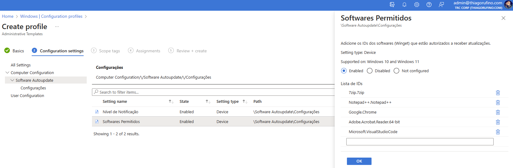
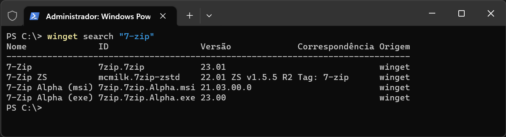
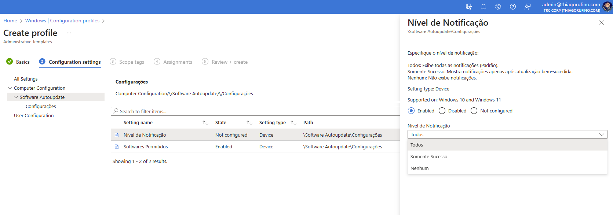
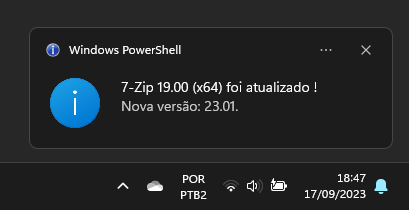
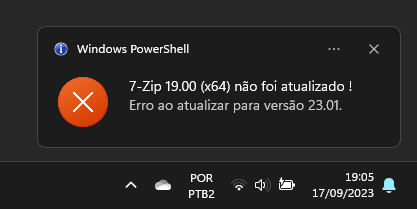
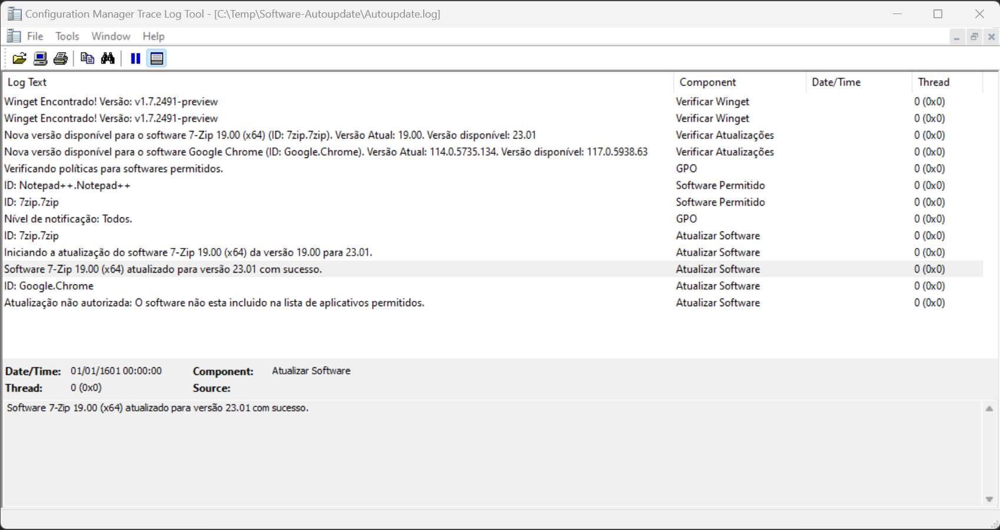
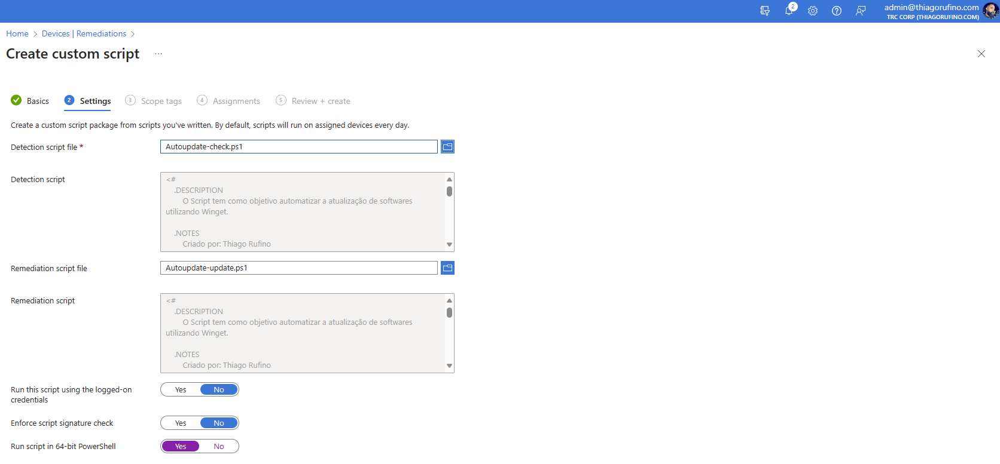
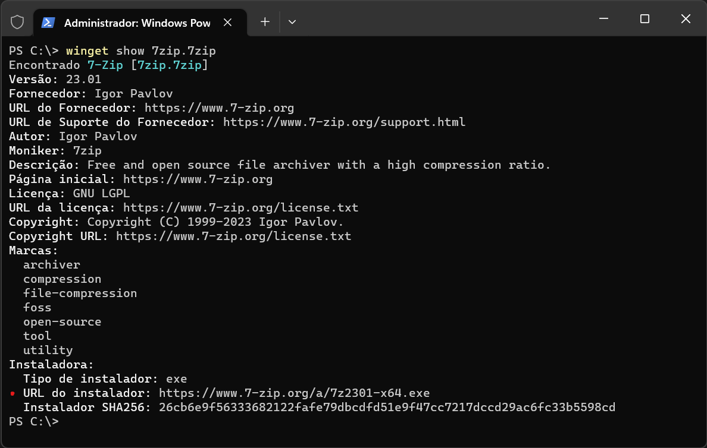

# Atualização Automática de Softwares com Intune e Winget.

Um dos grandes desafios enfrentados pelas empresas é manter o ambiente de workstations com softwares padronizados e atualizados, garantindo a segurança da infraestrutura. Os fabricantes constantemente lançam novas versões para corrigir vulnerabilidades, o que demanda esforços significativos da equipe de TI. O objetivo deste artigo é apresentar uma alternativa para automatizar o processo de atualização de softwares.

Este artigo demonstrará como automatizar o processo utilizando o recurso remediação do Intune, em conjunto com um template ADMX para estabelecer políticas que facilitam a seleção dos softwares elegíveis para atualização e a configuração do nível de notificação desejado.
<br>
<br>

# Configurações
<br>

# ADMX
# Lista de Softwares permitidos

Nesta configuração, você adiciona o ID do aplicativo ao Winget.
<p align="center">
    
</p>


>Para obter o ID dos softwares, você pode executar o comando `winget search` seguido do nome do software para realizar a pesquisa e obter o ID desejado.
Exemplo:
``` powershell
winget search "Google Chrome"
``````

<p align="center">
    
</p>

# Nível de Notificação

<p align="center">
    
</p>

Especifique o nível de notificação dentre as 3 opções abaixo:

* Todos: Exibe todas as notificações (Padrão).
* Somente Sucesso: Mostra notificações apenas após atualizações bem-sucedida.
* Nenhuma: Não exibe notificação.

<p align="center"><br>
        
    
</p>


# Log
Durante a execução do script, um arquivo de log é gerado para registrar as ações, o qual pode ser encontrado em `C:\Temp\Software-Autoupdate\Autoupdate.log`.

<p align="center">
    
</p>

# Script
Aqui estão as configurações a serem aplicadas em `Remediações` no Intune:

* Detection script file: [Autoupdate-check.ps1](https://github.com/thiagorufino1/thiagorufino1/blob/d8aef69b1815a45f97ce17a389942ad401d2d233/Intune/Software%20Autoupdate/Autoupdate-check.ps1)<br>
* Remediation script file: [Autoupdate-update.ps1](https://github.com/thiagorufino1/thiagorufino1/blob/d8aef69b1815a45f97ce17a389942ad401d2d233/Intune/Software%20Autoupdate/Autoupdate-update.ps1)


<p align="center">
    
</p>

# Obter URL de downloads do software via Winget

Para obter a URL do instalador utilizando pelo Winget, utilize o comando winget show "ID do Software".

Exemplo:
``` powershell
winget show 7zip.7zip
````

<p align="center">
    
</p>